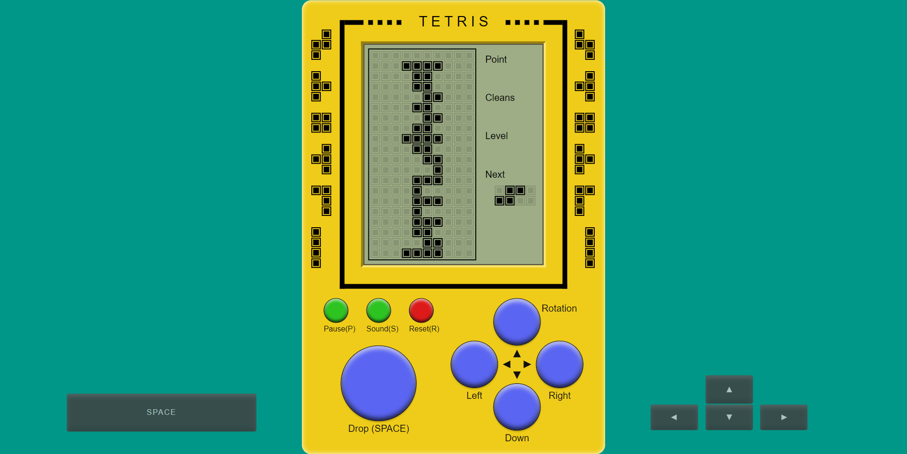

俄罗斯方块（Tetris）是一款经典的益智游戏，由俄罗斯游戏设计师阿列克谢·帕基特诺夫（Alexey Pajitnov）于1984年开发。该游戏因其简单但极具挑战性的玩法而风靡全球，成为电子游戏史上最具影响力和最受欢迎的游戏之一。




### 游戏玩法

- **基本规则**：玩家需要将从屏幕顶部不断下落的各种形状的方块（称为“tetrominoes”）移动和旋转，以使它们在底部堆积成完整的水平线。当一条线被填满时，它会消失，腾出空间并为玩家得分。
- **目标**：防止方块堆积到屏幕顶部。游戏会随着时间的推移逐渐加快速度，增加难度。
- **方块形状**：共有七种不同形状的方块，每种形状由四个方块组成，分别是：
  - I 型（直线型）
  - O 型（正方形）
  - T 型
  - S 型
  - Z 型
  - J 型
  - L 型

### 游戏特点

- **简单易学，难于精通**：游戏规则简单，但要达到高分需要玩家具备良好的反应速度和空间思维能力。
- **无尽模式**：大多数版本的俄罗斯方块没有明确的终点，游戏会一直进行，直到玩家无法继续堆叠方块。
- **经典音乐**：许多版本的俄罗斯方块都配有经典的背景音乐，如《卡林卡》和《柯萨克舞曲》，增强了游戏的吸引力。

### 影响和版本

俄罗斯方块的成功促使了众多版本和衍生作品的出现，包括：

- **掌机版**：如任天堂的Game Boy版本，这是最早也是最著名的掌机版本之一。
- **街机版**：在街机游戏机上也有多个版本。
- **现代版本**：在各种现代游戏平台上都有俄罗斯方块的版本，包括PC、手机、游戏机等。
- **变体和衍生作品**：例如，Tetris 99（一个多人在线对战版本），Tetris Effect（结合了视觉和音乐效果的版本）等。

### 文化影响

- **全球现象**：俄罗斯方块不仅在游戏界取得了巨大成功，还成为了一种文化现象，被广泛引用和模仿。
- **心理效应**：一些玩家报告称，在长时间玩俄罗斯方块后，会在现实生活中看到类似的方块形状，这被称为“俄罗斯方块效应”。


### 运行步骤

> 需要安装NodeJS,版本要求>=14.x

#### 1、安装依赖

```bash
npm install
```

#### 2、运行项目

```bash
npm run dev
```

#### 3、打包项目

```bash
npm run build
```

